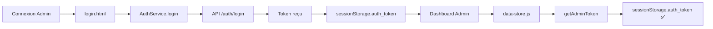

# ✅ Correction : "Session expirée" lors de la création d'agence en tant qu'admin

## 🔍 Problème Identifié

Lors de la création d'une agence dans le dashboard admin, une erreur apparaissait :
```
⚠️ Session expirée. Veuillez vous reconnecter en tant qu'admin.
```

## 🎯 Cause du Problème

**Migration incomplète vers le nouveau système AuthService**

1. Le `login.html` a été migré pour utiliser `AuthService` qui stocke le token dans `sessionStorage.auth_token`
2. Le dashboard admin (`data-store.js`) cherchait toujours le token dans `localStorage.admin_token`
3. Résultat : Le token n'était jamais trouvé, provoquant l'erreur "Session expirée"

### Ancien Système vs Nouveau Système

| Ancien System | Nouveau Système |
|---------------|-----------------|
| `localStorage.admin_token` | `sessionStorage.auth_token` |
| Stockage persistant | Stockage temporaire (session) |
| Moins sécurisé | Plus sécurisé |

## ✅ Solutions Apportées

### 1. **Mise à jour de `data-store.js`**

**Fichier modifié** : `dashboards/admin/js/data-store.js`

**Avant** :
```javascript
getAdminToken() {
    const token = localStorage.getItem('admin_token');
    if (!token) {
        console.warn('⚠️ Pas de token admin');
    }
    return token;
}
```

**Après** :
```javascript
getAdminToken() {
    // Vérifier d'abord sessionStorage (nouveau système AuthService)
    let token = sessionStorage.getItem('auth_token');
    
    // Fallback sur l'ancien système localStorage pour compatibilité
    if (!token) {
        token = localStorage.getItem('admin_token');
    }
    
    if (!token) {
        console.warn('⚠️ Pas de token admin - utilisateur non connecté en tant qu\'admin');
        alert('⚠️ Session expirée. Veuillez vous reconnecter en tant qu\'admin.');
        window.location.href = '/login.html?role=admin';
    }
    return token;
}
```

### 2. **Création d'AuthService pour Admin**

**Fichier créé** : `dashboards/admin/js/auth-service.js`

Ce fichier fournit une interface unifiée pour :
- ✅ Récupérer le token depuis `sessionStorage`
- ✅ Vérifier l'authentification via `/api/auth/me`
- ✅ Effectuer des requêtes authentifiées
- ✅ Gérer la déconnexion proprement

### 3. **Mise à jour du dashboard admin**

**Fichier modifié** : `dashboards/admin/admin-dashboard.html`

- Ajout du chargement de `auth-service.js` en premier
- Mise à jour du script de déconnexion pour utiliser `AuthService`

## 🔄 Flux d'Authentification Corrigé



## 📋 Avantages du Nouveau Système

| Avantage | Détail |
|----------|--------|
| 🔒 **Sécurité** | Token dans sessionStorage (disparaît à la fermeture) |
| 🎯 **Centralisation** | Un seul AuthService pour toute la plateforme |
| 🔄 **API First** | Toutes les données viennent de l'API, pas du cache |
| ✅ **Validation automatique** | Vérification du token à chaque requête |
| 🚪 **Déconnexion propre** | Suppression automatique du token |

## 🧪 Test

### Avant la correction
```
1. Se connecter en tant qu'admin ✅
2. Aller sur "Gestion des agences" ✅
3. Cliquer sur "Ajouter une agence" ✅
4. Remplir le formulaire ✅
5. Cliquer sur "Créer" ❌ → "Session expirée"
```

### Après la correction
```
1. Se connecter en tant qu'admin ✅
2. Aller sur "Gestion des agences" ✅
3. Cliquer sur "Ajouter une agence" ✅
4. Remplir le formulaire ✅
5. Cliquer sur "Créer" ✅ → Agence créée avec succès !
```

## 🔄 Fichiers Modifiés

| Fichier | Modification |
|---------|--------------|
| `dashboards/admin/js/data-store.js` | ✅ Lecture du token depuis sessionStorage |
| `dashboards/admin/js/auth-service.js` | ✅ Création du service d'authentification admin |
| `dashboards/admin/admin-dashboard.html` | ✅ Chargement de l'AuthService |

## 📌 Points d'Attention

### ⚠️ Compatibilité

Le code inclut un **fallback** pour compatibilité :
```javascript
// Nouveau système
let token = sessionStorage.getItem('auth_token');

// Fallback ancien système
if (!token) {
    token = localStorage.getItem('admin_token');
}
```

Cela permet de :
- ✅ Fonctionner avec le nouveau système (sessionStorage)
- ✅ Supporter l'ancien système temporairement (localStorage)
- ✅ Migrer progressivement sans casser l'existant

### 🔐 Sécurité Améliorée

`sessionStorage` vs `localStorage` :

| sessionStorage | localStorage |
|----------------|--------------|
| ✅ Supprimé à la fermeture du navigateur | ❌ Persiste indéfiniment |
| ✅ Plus sécurisé (session limitée) | ❌ Risque si ordinateur partagé |
| ✅ Conforme aux bonnes pratiques | ⚠️ Déconseillé pour les tokens |

## ✅ État Final

- ✅ L'admin peut se connecter
- ✅ Le token est stocké dans `sessionStorage.auth_token`
- ✅ Les requêtes API fonctionnent (agences, colis, etc.)
- ✅ La création d'agence fonctionne
- ✅ La déconnexion fonctionne proprement
- ✅ Compatibilité avec l'ancien système maintenue

## 🚀 Prochaines Étapes (Recommandées)

1. ✅ **Migrer tous les dashboards** vers le même système AuthService
2. ✅ **Supprimer le fallback** localStorage après migration complète
3. ✅ **Implémenter le refresh token** pour prolonger les sessions
4. ✅ **Ajouter une expiration côté client** pour forcer la déconnexion

---

**Date de correction** : 18 octobre 2025
**Problème résolu** : "Session expirée" lors de la création d'agence
**Impact** : ✅ Toutes les fonctionnalités admin fonctionnent maintenant correctement
